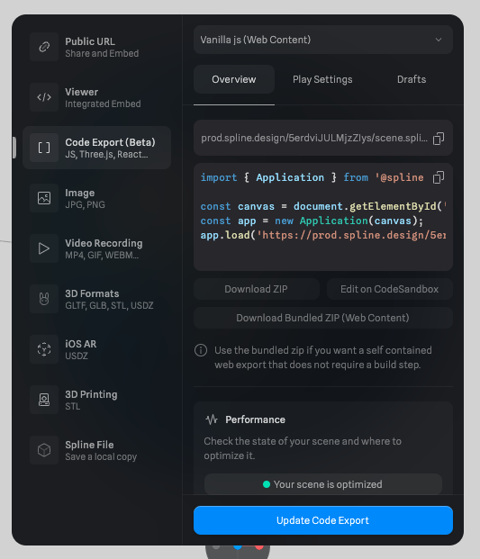

# spline-selfhosted

- demo repository to show selfhosting of spline 3D scene (exports)

Two approaches used:

- vanillajs runtime (https://www.npmjs.com/package/@splinetool/runtime)
- spline-viewer web component (https://www.npmjs.com/package/@splinetool/viewer)

Demo: 

- https://spline-selfhosted.vercel.app/ ([GDPR check](https://webbkoll.dataskydd.net/de/results?url=http%3A%2F%2Fspline-selfhosted.vercel.app%2F))

## Goals

- [x] GDPR-compatibility (no 3rd party connections / no cookies), checked with https://webbkoll.dataskydd.net/de/results?url=http%3A%2F%2Fspline-selfhosted.vercel.app%2F
- [ ] vanillajs: transparent background -> setBackgroundColor()?
- [ ] vanillajs: Follow mouse cursor 
- [ ] vanillajs: Use click events --> Handling events outside of Spline (https://docs.spline.design/77c32288501a479fa8bc5e787f1e0878)
- [ ] vanillajs: Use preload? https://www.npmjs.com/package/@splinetool/runtime#preloading-your-scene

## Local setup

```
npm install 
npm run dev
```

## How was this created?

Spline offers several ways to export code, see: [Exporting as Code
](https://docs.spline.design/77c32288501a479fa8bc5e787f1e0878). There is also a Web Component available: 
[spline-viewer](https://viewer.spline.design/).

First, we scaffold a new vite project with vanillajs:

```bash
# https://vitejs.dev/guide/#scaffolding-your-first-vite-project
npm create vite@latest . -- --template vanilla
```

### spline runtime (vanillajs)

1. Install it:


```bash
# https://www.npmjs.com/package/@splinetool/runtime
npm install @splinetool/runtime
```

2. Export spline scene

Use "Download bundled zip (Web content)" here:



Unzip it and place the `scene.splinecode` file into `public/3d-models`.

3. Add `<canvas>` to index.html, add spline JS code to main.js

Instead of loading the scene from the spline server, we use the local file:

```js
spline.load('/3d-models/planet/scene.splinecode');
```


### spline-viewer web component

1. Install it: 
```bash
# https://www.npmjs.com/package/@splinetool/viewer
npm install @splinetool/viewer
```

2. Import it in main.js:

```js
// import spline-viewer web component
import { SplineViewer } from '@splinetool/viewer';
```

3. Just use the exported spline scene (see above) in HTML:

```
<spline-viewer width="500" height="500" url="/3d-models/planet/scene.splinecode"></spline-viewer>
```

## Credits

- 3D Model example from spline: Planet (https://spline.design/examples)

### Resources

- Spline runtime docs: https://docs.spline.design/77c32288501a479fa8bc5e787f1e0878
- Spline viewer docs: https://docs.spline.design/67b4c8ec0d2b46dd8588a99a7e94db6e